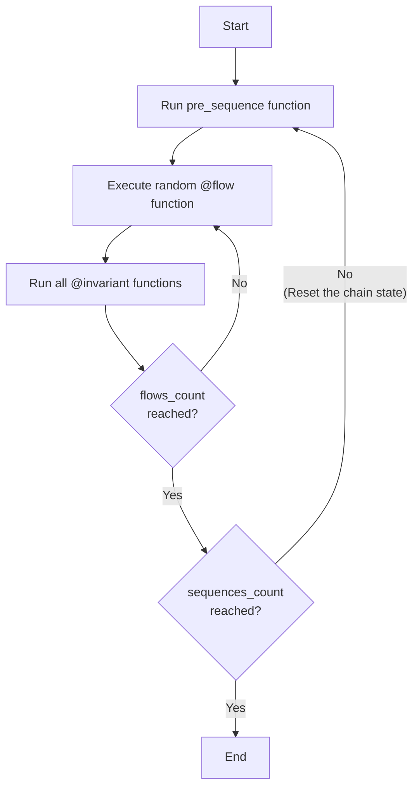

# The Art of Manually Guided Fuzzing

## 📦 Wake Installation

```bash
pip3 install -U eth-wake
```

Verify installation by running `wake` - it should display Wake usage information.

### Foundry Installation

Install Foundry for the Anvil testing environment:

```bash
curl -L https://foundry.paradigm.xyz | bash
source ~/.bashrc && foundryup
```

**Windows Users:** See [Windows Installation Guide](WINDOWS_INSTALLATION.md)

### VSCode Extension

Install the [Solidity Python Extension Pack](https://marketplace.visualstudio.com/items?itemName=AckeeBlockchain.solidity-python-pack), which includes:

- [Solidity (Wake)](https://marketplace.visualstudio.com/items?itemName=AckeeBlockchain.tools-for-solidity) - Remix-like UI, static analysis, Solidity support
- [Python](https://marketplace.visualstudio.com/items?itemName=ms-python.python) - Python language support


## ⚙️ Wake Testing Setup

### Project Initialization

```bash
wake up
```

Initializes your Wake environment with default configuration.

### 🚀 Run Example Test

```bash
wake test tests/test_vault_unit.py
```

This displays a detailed call trace and test results.

### Configuration: `wake.toml`

The `wake.toml` file controls your testing environment.

**Testing Environment:**
```toml
[testing]
cmd = "anvil"  # Options: anvil, revm, or others
```

**Compiler Settings:**
```toml
[compiler.solc]
exclude_paths = ["script", ".venv", "venv", "node_modules", "lib", "test"]
include_paths = ["node_modules"]
remappings = []
```

`wake up` automatically configures remappings. See [compiler documentation](https://ackee.xyz/wake/docs/latest/compilation/#include-paths) for details.

### Static Analysis Tools

**Detectors:** `wake detect` - Lists available security detectors
**Printers:** `wake print` - Lists available code analysis printers

Results will be printerd into the console and stored in `.wake/`. The VSCode extension displays detector results inline.


## 🧪 Unit Testing with Wake

### Key Files

- [SingleTokenVault](contracts/Vault.sol) - Contract under test
- [Vault Unit Test](tests/test_vault_unit.py) - Example `deposit` function test

### Running Tests

```bash
wake test tests/test_vault_unit.py
```

**Run specific test function:**
```bash
wake test tests/test_wake_usage.py::test_account
```

### Testing Features

**Call Traces:**
```python
print(tx.call_trace)
```

**Events:**
```python
print(tx.events)
```

**Debug Mode:** Interactive debugging on exceptions
```bash
wake test tests/test_vault_unit.py -d
```

**Console Logging:**
```solidity
import "wake/console.sol"; // add this to the top of your file
console.log(variableName);
console.logBytes32(bytes32(0));
```

Generate Python types for better IDE support:
```bash
wake init pytypes
```

### More Resources

- [Wake Usage Tests](tests/test_wake_usage.py) - Core testing features
- [Wake Signing Tests](tests/test_wake_usage_signing.py) - Signing and EIP-712 examples

### 📝 Task: Write Unit Tests

Using [Token Unit Test](tests/test_token_unit_test.py) as reference, extend [test_vault_unit.py](tests/test_vault_unit.py):

1. Look at the [Vault Unit Test](tests/test_vault_unit.py) for examples.
2. Examine the [Vault Contract](contracts/Vault.sol) to understand the contract's functionality.
3. Implement your own test cases in [test_vault_unit.py](tests/test_vault_unit.py):
   - [ ] Test event emission in deposit
   - [ ] Test ERC20 balance changes using `token.balanceOf()`
   - [ ] Test withdrawal functionality
   - [ ] Test deposit limits
   - [ ] Add additional custom test scenarios


## 🎲 Fuzzing with Wake

### Manually Guided Fuzzing Overview

Manually guided fuzzing combines random inputs with structured test scenarios. See [this blog post](https://ackee.xyz/blog/introducing-manually-guided-fuzzing-a-new-approach-in-smart-contract-testing/) for a more detailed overview.

### Setup

Create a class inheriting from `FuzzTest`:

```python
class VaultFuzz(FuzzTest):
    # Implementation here

VaultFuzz.run(sequences_count=1, flows_count=100)
```

The base `FuzzTest` class has a `run` method that will run the test, where you can specify the number of sequences and flows.

### 🔄 Execution Flow



### Flows

Flows are:
- Sequence of actions or transactions
- Defined by the tester
- Tester writes code to generate random arguments for the transaction call

**Good practices:**
- One transaction call per flow function
- Assert all expected events and behaviors
- Generate random arguments for transaction calls


### Invariants

**Purpose:** Verify contract state consistency after each flow.

**Function:** Compare contract variables with expected values tracked in Python's mirrored test state.

## 💡 Advanced Fuzzing Features

### Reproducing Issues

**Use specific seed to reproduce the issue:**
```bash
wake test tests/test_fuzz.py -S 0abcdefg...
```
(The seed is also printed in the console at the beginning of the test.)

**Multi-process testing:**
```bash
wake test tests/test_fuzz.py -P 4
```

### Debugging

**Use breakpoint to stop execution and inspect the state:**
```python
breakpoint()
```

**Crash logs:** Located in `.wake/logs/crashes` - contains random state for reproduction.

### Shrinking

After encountering an error in fuzzing, it might be hard to find what caused this error.
Shrinking automatically removes redundant flow executions to find the minimal test case that reproduces the error.

**Run shrinking:**
```bash
wake test tests/test_fuzz.py -SH
```

**Execute shrunken test:**
```bash
wake test tests/test_fuzz.py -SR
```

### 📝 Task: Write Fuzzing Tests

Using [Fuzz Template](tests/fuzz_template.py) as reference, implement [Vault Fuzz](tests/test_vault_fuzz.py):

1. Get ideas from the fuzz test template [Fuzz Template](tests/fuzz_template.py)
2. Examine the [SingleTokenVault](contracts/Vault.sol) contract
3. Implement fuzz test in [Vault Fuzz](tests/test_vault_fuzz.py):
   1. [ ] Create `pre_sequence` function and define contracts.
   2. [ ] Create `@flow` function for `SingleTokenVault.deposit` function.
   3. [ ] Add limit data in the Python test that stores limit values.
   4. [ ] Add balance data in the Python test that stores deposited values.
   5. [ ] Create `@invariant` function for checking the above balance.
   6. [ ] Create `@flow` function for `SingleTokenVault.withdraw` function.
   7. [ ] Add ERC20 token balance data in Python test.
   8. [ ] Create `@invariant` function for checking the above balance.
   9. [ ] Create `@flow` for all state-changing functions.
   10. [ ] Add your own custom flow or invariant with your imagination!

**Solution:** [Vault Fuzz Solution](tests/test_vault_fuzz_solution.py)
