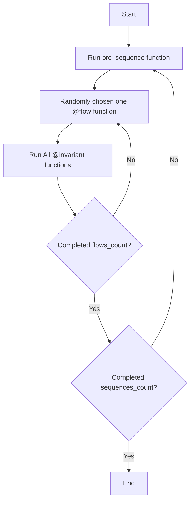

# The art of Manually guided fuzzing

## 📦 Installation of Wake

```bash
pip3 install -U eth-wake
```

Check installation by running `$ wake`. It should show Wake usage.

Install Foundry to use the Anvil environment for testing.

Run these commands:

```bash
curl -L https://foundry.paradigm.xyz | bash
```

```bash
source ~/.bashrc && foundryup
```

Windows Users: see [Windows Installation Guide](WINDOWS_INSTALLATION.md)

### VSCode Extension

Recommended [Solidity Python Extension Pack](https://marketplace.visualstudio.com/items?itemName=AckeeBlockchain.solidity-python-pack).

It already contains:

- [Solidity (Wake)](https://marketplace.visualstudio.com/items?itemName=AckeeBlockchain.tools-for-solidity) - Remix-like UI, static analysis (detectors), general Solidity support
- [Python](https://marketplace.visualstudio.com/items?itemName=ms-python.python) - general Python support


## ⚙️ Usage of Wake for Testing

### Initialize the project

```bash
wake up
```

This will initialize your Wake environment.

### 🚀 LETS RUN EXAMPLE TEST! 🎉

```bash
wake test tests/test_vault_unit.py
```

This should show a nice call trace. ✨

### Config file: `wake.toml`

`/wake.toml` is the environment file.

You can change the testing environment: Anvil, Revm, or others.

```toml
[testing]
cmd = "anvil"
```

Compiler settings. Generally, `wake up` automatically applies remappings to this config.

```toml
[compiler.solc]
exclude_paths = ["script", ".venv", "venv", "node_modules", "lib", "test"]
include_paths = ["node_modules"]
remappings = []
```

Details of compiler settings can be found in the [compiler setting documentation](https://ackee.xyz/wake/docs/latest/compilation/#include-paths).

### Usage of detector and printer from Wake

The VSCode extension shows detection results on your codebase.

- `$ wake detect` to see available detectors.

- `$ wake print` to see available printers.

The printer results are stored in `.wake/`.


## 🧪 Testing with Wake

We'll start by examining two key files:

- [SingleTokenVault](contracts/Vault.sol) - The contract we're testing
- [Vault Unit Test](tests/test_vault_unit.py) - A test focusing on the `deposit` function

### 🚀 Running the Test

Execute the test using this command:

```bash
wake test tests/test_vault_unit.py
```

### 📊 What to Expect

After running the test, you'll see:

- Detailed call traces
- Test execution results
- Function interactions

### Call trace

In Python test code:

```python
print(tx.call_trace)
```

### Events

In Python test code:

```python
print(tx.events)
```

### Debugging mode

This mode enables interaction when an exception happens. You can call other functions in interactive mode.

```bash
wake test tests/test_vault_unit.py -d
```

### Console logs

The console log messages show in the call trace.

```sol
import "wake/console.sol";

~
console.log(variableName);
~
console.logBytes32(bytes32(0));
```

```bash
wake init pytypes
```

```python
print(tx.call_trace)
```

## 🔧 Wake Testing APIs

### Basic Wake Testing Examples

Check out [Wake Usage Tests](tests/test_wake_usage.py) for examples of Wake's core testing features.

### 🎯 Running Specific Tests

To run a single test function instead of the entire file (e.g., `test_account` unit test), do this:

```bash
wake test tests/test_wake_usage.py::test_account
```

### 📚 What You'll Learn

Each test unit demonstrates:

- Core Wake testing features
- Common testing patterns
- Best practices for smart contract testing

### Signing in `wake test`

Examine [Wake Signing Usage Tests](tests/test_wake_usage_signing.py) for signing examples including EIP-712 features.

### 📝 Task: Write Your Own Wake Unit Test

1. Get idea from the example test in [Token Unit Test(tests/test_token_unit_test.py)](tests/test_token_unit_test.py)
2. Examine the [SingleTokenVault](contracts/Vault.sol) contract
3. Implement additional test cases in [test_vault_unit.py](tests/test_vault_unit.py):
   - [ ] Test event emission in deposit functionality
   - [ ] Test ERC20 token balance before and after by using `token.balanceOf()`
   - [ ] Test withdrawal functionality
   - [ ] Test deposit limits
   - [ ] Add your own test scenarios!


## 🎲 Fuzzing with Wake

Finally, we've reached the main part!!

### Manually guided Fuzzing

What is manually guided fuzzing? Look at the presentation.

### Initial Setup

Define a new class that derives from `FuzzTest`. The `FuzzTest` class has a `run` function, and calling this function starts the fuzz testing.

In this case, VaultFuzz derives from `FuzzTest`.

```python
VaultFuzz.run(sequences_count=1, flows_count=100)
```

### 🔄 Execution Cycle



### Flow

- Sequence of actions or transactions
- Defined by the tester
- Tester writes code to generate random arguments for the transaction call

**Key Point:**

- **One transaction call in one flow function**
- Assert all events and behavior in the test

### Invariant

- Checks that all variables in the contract are the same as the variables in the Python test
- Runs all invariant functions after every flow

## 💡 MGF Pro Tips

How to write code and testing tips

### Seed of Fuzzing

When you encounter an exception, it generally does not show the exact reason.

```bash
wake test tests/test_fuzz.py -S 0abcdefg...
```

### Multi-process testing

```bash
wake test tests/test_fuzz.py -P 4
```

### Breakpoint

```python
breakpoint()
```

### Crash log

Crash logs exist at `.wake/logs/crashes`.
This file contains the internal random state at the beginning of the test.

### Shrinking

After you encounter an error in fuzzing, it is harder to find what caused this error.
The shrinking automatically removes redundant flow executions.

Run shrinking by:

```bash
wake test tests/test_fuzz.py -SH
```

Run the shrunken test by:

```bash
wake test tests/test_fuzz.py -SR
```

### 📝 Task: Write Your Own Manually Guided Fuzzing

1. Get ideas from the fuzz test template [Fuzz Template](tests/fuzz_template.py)
2. Examine the [SingleTokenVault](contracts/Vault.sol) contract
3. Implement fuzz test in [Vault Fuzz](tests/test_vault_fuzz.py):
   1. [ ] Create `pre_sequence` function and define contracts.
   2. [ ] Create `@flow` function for `SingleTokenVault.deposit` function.
   3. [ ] Add limit data in the Python test that stores limit values.
   4. [ ] Add balance data in the Python test that stores deposited values.
   5. [ ] Create `@invariant` function for checking the above balance.
   6. [ ] Create `@flow` function for `SingleTokenVault.withdraw` function.
   7. [ ] Add ERC20 token balance data in Python test.
   8. [ ] Create `@invariant` function for checking the above balance.
   9. [ ] Create `@flow` for all state-changing functions.
   10. [ ] Add your own flow or invariant with your imagination!

> Solution is [Vault Fuzz Solution](tests/test_vault_fuzz_solution.py)
