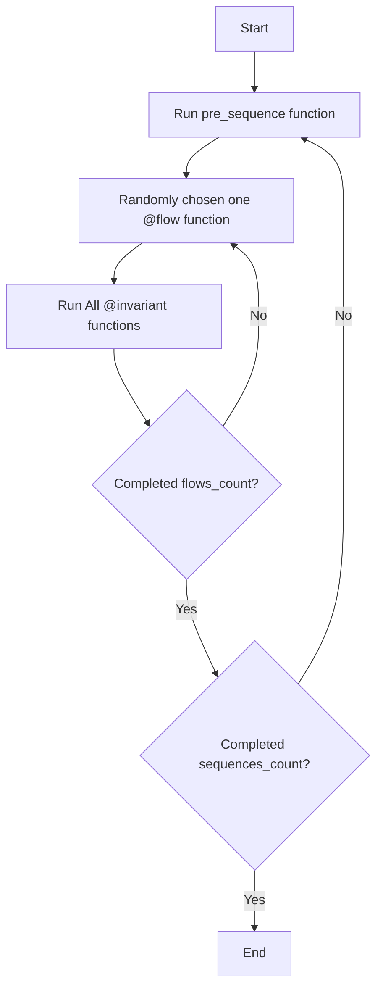

# The art of Manually guided fuzzing

## Usage of Wake for Testing

### Installation of wake

```bash
pip install eth-wake
```

Check installation by `$ wake`. It should show wake Usage.

Installing foundry to use anvil environment for testing.

Run them.

```bash
curl -L https://foundry.paradigm.xyz | bash
```

```bash
foundryup
```

Windows Users: see [Windows Installation Guide](WINDOWS_INSTALLATION.md)

### Initialize the project

```bash
wake up
```

This will initialize your wake environment.

LETS RUN EXAMPLE TEST!!!!!!

```bash
wake test tests/test_vault_unit.py
```

This should show nice call trace.

#### `wake.toml`

`/wake.toml` is Environemnt file.

You can change testing environment. Anvil, Revm or others.

```toml
[testing]
cmd = "anvil"
```

Compiler setting. Generally `wake up` automatically apply remappings to this config.

```toml
[compiler.solc]
exclude_paths = ["script", ".venv", "venv", "node_modules", "lib", "test"]
include_paths = ["node_modules"]
remappings = []
```

Details of compiler setting is [compiler setting](https://ackee.xyz/wake/docs/latest/compilation/#include-paths).

### VSCode Exstension

Find `Solidity (Wake)` from market place, and install it.
It supports Deploy and Interact of on-chain contract.
And it shows static analysis results.

### Usage of detector and printer from wake

VScode extension shows detection result on your code base.

- `$ wake detect` to see available detectors.

- `$ wake print` to see available printers.

The printer result stored in `.wake/`.

## Testing with Wake

We'll start by examining two key files:

- [SingleTokenVault](contracts/Vault.sol) - The contract we're testing
- [Vault Unit Test](tests/test_vault_unit.py) - A test focusing on the `deposit` function

### 🚀 Running the Test

Execute the test using this command:

```bash
wake test tests/test_vault_unit.py
```

### 📊 What to Expect

After running the test, you'll see:

- Detailed call traces
- Test execution results
- Function interactions

### Call trace

In python test code

```python
print(tx.call_trace)
```

### Events

In python test code

```python
print(tx.events)
```

### Debugging mode

This mode enable interact when exception happen. You can call other function in interactive mode.

```bash
wake test tests/test_vault_unit.py -d
```

### Console logs

The console log messages shows in call trace.

```sol
import "wake/console.sol";

~
console.sol(variableName);
~
console.logBytes32(bytes32(0));
```

```bash
wake init pytypes
```

```python
print(tx.call_trace)
print(tx.console_log)
```

## Wake Testing APIs

### Basic Wake Testing Examples

Check out [Wake Usage Tests](tests/test_wake_usage.py) for examples of Wake's core testing features.

### 🎯 Running Specific Tests

To run a single test function instead of the entire file e.g. `test_account` unit test:

```bash
wake test tests/test_wake_usage.py::test_account
```

### 📚 What You'll Learn

Each test unit demonstrates:

- Core Wake testing features
- Common testing patterns
- Best practices for smart contract testing

### Signing in `wake test`

Examine [wake Signing Usage Tests](tests/test_wake_usage_signing.py) for signing example including EIP-712 feature.

### 📝 Task: Write Your Own Wake Unit Test

1. Get idea from the example test in [Token Unit Test(tests/test_token_unit_test.py)](tests/test_token_unit_test.py)
2. Examine the [SingleTokenVault](contracts/Vault.sol) contract
3. Implement additional test cases in [test_vault_unit.py](tests/test_vault_unit.py):
   - [ ] Test Event emission in deposit functionality
   - [ ] Test ERC20 Token balance of before and after by using `token.balanceOf()`
   - [ ] Test withdrawal functionality
   - [ ] Test deposit limits
   - [ ] Add your own test scenarios!

## Fuzz test with wake

Finally, reached main part!!

### Manully guided Fuzzing

What is manually guided fuzzing, look at the presentation

### Initial Setup

```python
VaultFuzz.run(sequences_count=1, flows_count=100)
```

### 🔄 Execution Cycle



### Flow

- Sequence of actions or transactions
- defined by the tester
- Tester writes code to generate random arguments of the transaction call

**Key Point:**

- One transaction call in one flow function
- Assert all events and behavior in the test

### Invariant

- Checks that all variables in the contract are the same as the variables in the Python test
- Run all invariant functions after every flow

## MGF pro tips

How to write code and testing tips

### Seed of Fuzzing

When you reached exception, but generally it does not show exact reason.

```bash
wake test tests/test_fuzz.py -S 0abcdefg...
```

### Multi process testing

```bash
wake test tests/test_fuzz.py -P 4
```

### Breakpoint

```python
breakpoint()
```

### Crash log

Crash log exist at `.wake/logs/crashes`.
This file contains internal random state of beginning of test.

### Shrinking

Running shrinking. And it will show

```bash
wake test tests/test_fuzz.py -SH
```

Run shrank test by

```bash
wake test tests/test_fuzz.py -SR
```

### 📝 Task: Write Your Own Manually Guided Fuzzing

1. Get idea from the fuzz test template [Fuzz Template(tests/fuzz_template.py)](tests/fuzz_template.py)
2. Examine the [SingleTokenVault](contracts/Vault.sol) contract
3. Implement fuzz test in [Vault Fuzz(tests/test_vault_fuzz.py)](tests/test_vault_fuzz.py):
   1. [ ] Create `pre_sequence` function and define contracts.
   2. [ ] Create `@flow` function for `SingleTokenVault.deposit` function.
   3. [ ] Add limit data in the python test that store limits value.
   4. [ ] Add balance data in the python test that store deposited value.
   5. [ ] Create `@invaraint` function for checking above balance.
   6. [ ] Create `@flow` function for `SingleTokenVault.withdraw` function.
   7. [ ] Add ERC20 token balance data in python test
   8. [ ] Create `@invaraint` function for checking above balance.
   9. [ ] Create `@flow` for all state changing functions.
   10. [ ] Add your own flow or invariant with your imagination!

> Solution is [Vault Fuzz Solution(tests/test_vault_fuzz_solution.py)](tests/test_vault_fuzz_solution.py)
